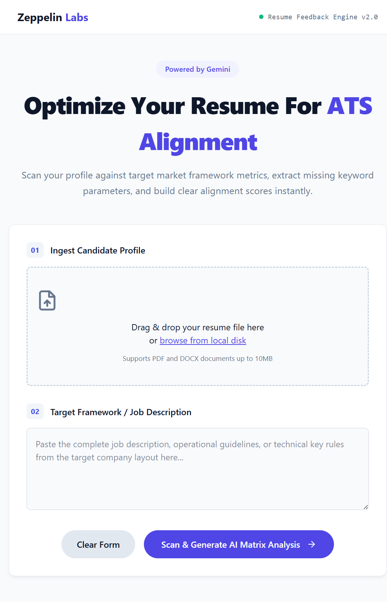
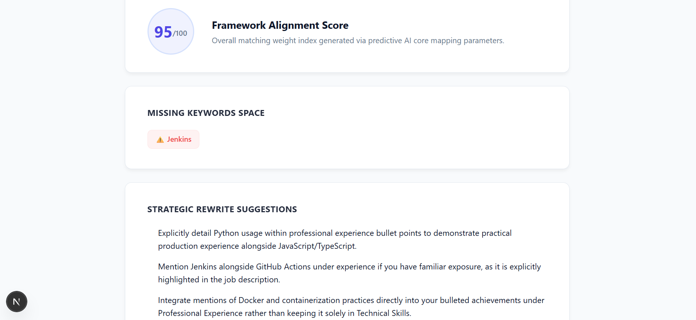

# Zeppelin AI Resume Screener




> An AI-powered resume analysis and feedback engine that compares resumes against job descriptions using Google Gemini to generate ATS-oriented insights, identify missing keywords, and provide actionable improvement suggestions.

Developed as part of the **Zeppelin AI & Generative AI Fellowship**.

---

## Overview

The Zeppelin AI Resume Screener streamlines the initial resume evaluation process by combining document parsing with Generative AI. Users can upload a resume in PDF or DOCX format, provide a target job description, and receive an AI-generated analysis that includes a compatibility score, missing keywords, and strategic recommendations for improving alignment with the target role.

The application consists of a **Next.js frontend** for user interaction and a **FastAPI backend** responsible for resume extraction, prompt generation, and communication with the Google Gemini API.

---

## Features

- AI-powered resume analysis using Google Gemini
- Resume upload support for PDF and DOCX documents
- Automatic resume text extraction
- Job description comparison
- AI-generated resume compatibility score
- Missing keyword identification
- Resume improvement suggestions
- JSON-based AI response handling
- Temporary upload cleanup after analysis
- Input validation and error handling

---

## Technology Stack

### Frontend

- Next.js
- React
- TypeScript

### Backend

- Python
- FastAPI

### AI

- Google Gemini API
- Google GenAI SDK

### Document Processing

- PyPDF2
- python-docx

### Environment & Utilities

- python-dotenv

---

## Project Structure

```text
zeppelin-ai-resume-screener
│
├── frontend/
│   └── app/
│       ├── globals.css
│       ├── layout.tsx
│       └── page.tsx
│
├── models/
│   └── analysis.py
│
├── routes/
│   └── analysis.py
│
├── uploads/          # Temporary uploaded resume files
│
├── ai_handler.py
├── pdf_utils.py
├── prompt_template.py
├── server.py
├── package.json
└── requirements.txt
```

---

## System Workflow

```text
User Uploads Resume
          │
          ▼
Resume Text Extraction
(PDF / DOCX)
          │
          ▼
Job Description Input
          │
          ▼
Prompt Construction
          │
          ▼
Google Gemini API
          │
          ▼
Structured JSON Response
          │
          ▼
Frontend Visualization
```

---

## Installation

### 1. Clone the repository

```bash
git clone https://github.com/suraiba-idrees/zeppelin-ai-resume-screener.git
```

### 2. Navigate to the project directory

```bash
cd zeppelin-ai-resume-screener
```

### 3. Create a virtual environment

```bash
python -m venv .venv
```

### 4. Activate the environment

**Windows**

```bash
.venv\Scripts\activate
```

**Linux / macOS**

```bash
source .venv/bin/activate
```

---

### 5. Install backend dependencies

```bash
pip install -r requirements.txt
```

---

### 6. Install frontend dependencies

```bash
cd frontend
npm install
```

---

## Environment Variables

Create a `.env` file in the project root.

Example:

```env
GEMINI_API_KEY=your_api_key_here
```

> Never commit your actual API key to GitHub.

A `.env.example` file is included in the repository:

```env
GEMINI_API_KEY=your_gemini_api_key_here
PORT=8000
ENVIRONMENT=development
```


---

## Deployment

The application has been deployed successfully using cloud platforms:

| Component | Platform | Status |
|-----------|----------|--------|
| Frontend | Vercel | ✅ Deployed |
| Backend | FastAPI Cloud | ✅ Deployed |

### Live Application

**Frontend**

https://zeppelin-ai-resume-screener.vercel.app

**Backend API**

https://zeppelin-ai-resume-screener.fastapicloud.dev

The deployed frontend communicates with the FastAPI backend through REST API endpoints to perform AI-powered resume analysis using Google Gemini.

--- 

## Running the Application

### Start the backend

```bash
py server.py
```

### Start the frontend

```bash
cd frontend
npm run dev
```

> **Note:** A live deployed version of the application is available in the **Deployment** section above.

---

## API Endpoint

The backend exposes a REST API for resume analysis.

### Analyze Resume

**Endpoint**

```http
POST /api/analyze
```

**Content-Type**

```text
multipart/form-data
```

### Request Parameters

| Parameter | Type | Required | Description |
|-----------|------|----------|-------------|
| `resume` | File | ✅ | Resume in PDF or DOCX format |
| `job_description` | String | ✅ | Target job description |

### Example Response

```json
{
  "match_score": 82,
  "missing_keywords": [
    "REST APIs",
    "Node.js",
    "Backend Development"
  ],
  "suggestions": [
    "Highlight backend development experience.",
    "Include relevant technical keywords.",
    "Expand project descriptions with measurable impact."
  ]
}
```

---

## Usage

1. ccess the live application or launch the frontend and backend servers locally.
2. Open the application in your browser.
3. Upload a resume in **PDF** or **DOCX** format.
4. Enter the target job description.
5. Click **Scan & Generate AI Matrix Analysis**.
6. Review the generated analysis, including:
   - Framework Alignment Score
   - Missing Keywords
   - AI-generated Resume Improvement Suggestions

---

## Error Handling

The application includes validation and exception handling for common scenarios, including:

- Missing job description
- Unsupported file formats
- Empty or unreadable resume files
- Invalid AI response format
- Temporary Gemini API service unavailability
- Automatic cleanup of uploaded temporary files

---

## Screenshots

### 1. Resume Uploaded


### 2. Analysis Results



---

## Future Improvements

Potential future enhancements include:

- Support for additional resume formats
- Multiple job description comparison
- Downloadable PDF feedback reports
- Resume history and previous analyses
- Authentication and user profiles
- Enhanced ATS scoring methodology
- Batch resume processing
- Cloud monitoring and performance optimization

---

## Project Team

| Role | Member |
|------|--------|
| **Team Lead** | Suraiba Idrees |
| **Member** | Maryam Imran Shah |
| **Member** | Aniqa Qamar |
| **Member** | Saboora Khalil |

---

## Acknowledgements

This project was developed as part of the **Zeppelin AI & Generative AI Fellowship**, with the objective of applying modern AI technologies to solve practical recruitment and resume screening challenges.

Special thanks to the Zeppelin Labs team for providing the learning platform and project framework.

---

## License

This project is licensed under the **MIT License**.

---

## Contributing

Contributions, suggestions, and improvements are welcome.

If you would like to contribute:

1. Fork the repository.
2. Create a new feature branch.
3. Commit your changes using meaningful commit messages.
4. Open a Pull Request for review.

---

## Contact

For questions or suggestions regarding this project, please open an Issue in this repository.

---